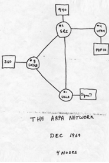

# CAPITULO 3
<h2>Historia</h2>

<h2>comutação de pacotes</h2>

A pesquisa sobre a <b>computação de pacotes</b> começou na década de 1960 e redes de comunicação de pacotes, como <b>mark I</b>, no <b>NPL no Reino Unido</b>, <b>ARPANET</B>, <B>CYCLADES</B>, <B>Merit Network</b>, Tymnet e Telenet, foram desenvolvidas em finaldos anos 1960 e inicio dos anos 1970, usando uma variedade de <b>protocolos</b>. A ARPANET, em particular, levou ao desinvolvimento de protocolos para <b>intemetworking</b>, onde varias redes separadas poderiam ser unidas em uma rede de redes. Os doisprimeiros <b>nós</b> do que viria a ser a ARPANET foram interconectados entre o Network Measurement Center de <b>Leonard Kleinrock</b> na Escola de Engenharia e Ciencias
Aplicadas da <b>UCLA</b> e o sistema NLS de <b>Dlougas Engelbart</b> no <b>SRI International</b> (SRI), em <b>Menlo Park</b>, <b>California</b>, em 29 de outubro de 1969. O terceiro nó da ARPANET era o Culler-Fried Interactive Mathematics Center da <b> Univercidade da California em Santa Bárbara</b> e o quarto era o Departamento Grafico da <b> Universidade de Utah</b>. Em um sinal precoce de crescimento futuro, já havia quinze sites conectados a jóvem ARPANET até o final de 1971.

<h2>RFC 675</h2>

Em dezembro de 1974, o <b>RFC 675</b> -Specification Control Program, de Vinton Cerf, Yogen Dalal e Carl Sunshipe usou o termo internet como uma abreviação para <b>intemetworking</b> e <b>RFCs</b> posteriores repetiram esse termo. O acesso á ARPANET foi ampliado.

<h1>obrigado por ler esse documentario</h1>
<h2>o capitulo 4 em breve</h2>
<h3>feito por euler.dev</h3>
