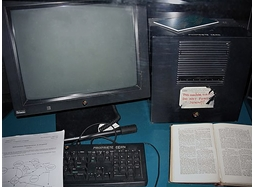

# CAPITULO 4

<h1>Fundação Nacional da Ciencia</h1>

em 1981, quando a <b>Fundação Nacional da Ciencia</b> (NSF), desenvolvido a Computer Science Network (CSNET). Em 1982, o Internet Protocol Suite (<b>TCP/IP</b>) foi padronizada e o conceito de uma rede mundial de redes TVP/IP totalmente interligadas chamado de internet foi introduzido.

<h2>o acesso da rede TCP/IP</h2>

O acesso á rede TCP/IP expandiu-se novamente em 1986, quando o <b>Nacional Science Foundation Network</b> (NSFNET) proveu acesso a sites de <b>supercomputadores</b> nos Estados Unidos a partir de organizações de pesquisas e de educação, o primeiro a 56 <b>kbit/s</b> e, mais tarde, 1,5 <b>Mbit/s</b> e 45 Mbit/s.

<h2>a organização Europeia<h2>

A <b>Organização Europria para a Inverstigação Nuclear</b> (CERN) foi a responsavel pela investigação da <b>Word Wide Web</b>, ou simplesmente a Web, como hoje a conhecemos. Corria o ano de 1990,e o que, numa primeira fase, permitia apenas aos cientistas trocar dados, acabou por se tornar a complexa e essencial Web. O responsavel pela invenção chama-se <b>Tim Berners-Lee</b>, que construiu o seu primeiro programa para armazenamento de informação - chamava-se Enquire e, embora nunca tenha sido publicada, foi base para o desinvolvimento da Web. Em 1989, proposum projeto de <b>hipertexto</b> que permitia ás pessoas trabalhar em conjunto, combinando o seu conhecimento numa rede de documentos. Foi esse projeto que ficou conhecido como a <b>World Wide Web</b>. A Web funcionou primeiro dentro do CERN, e no verãode 1991 foi disponibilizada mundialmente.