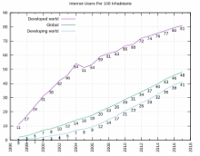

# CAPITULO 5

<h2> A internet comercializada</h2>

A Internet foi totalmente comercializada nos Estados Unidos em 1995, quando a NSFNET foi desmantelada, removendo as últimas restrições sobre o uso da Internet para transportar o trafego comercial. A Internet começou uma rapida expanção para a <b>Europa</b> e <b>Australia</b> em meados da décadas de 1980 e para a <b>Àsia</b> no final dos anos 1980 e inicio dos anos 1990.

<h2>O impacto da Internet</h2>

Desde meados da década de 1990 a Internet teve em enorme impacto sobre a <b>cultura</b> e o <b>comércio</b> mundiais, como pelo aumento da comunicação instantanea atravez de <b>e-mais</b>, <b>mensagens instantaneas</b>, "telefonemas"<b>VoLP</b>, chamadas de video interativas, com a <b>Word Wide Web</b> e seus <b>fóruns de disculção, blogs, redes sociais</b> e sites de <b> compras online</b>. Quantidades crescentes de dados são transmitidos em velocidade cada vez mais elevadas em redes de <b>fibra optica</b> operando a 1 <b>Gbit/s</b>, 10 Gbita/s, ou mais.

<h2>A Internet continua a crescer?</h2>

A Internet continua a crescer, impulsionando quantidades cada vez maiores de informações <b>online</b> e de conhecimento, comercio, entreterimento e redes sociais. Durante a década de 1990, estimou-se que o trafego na internet pública cresceu cerca 100% ao ano, enquanto estima-se que o crescimento anual do número de usuários seja de algo entre 20% e 50%. Este
 crescimento é muitas vezes atribuído à falta de uma administração central, que permita o crescimento orgânico da rede, bem como pela natureza não proprietária e aberta dos <b>protocolos de internet</b>, o que incentiva o fornecedor de interoperabilidade e impede qualquer empresa de
 exercer muito controle sobre a rede.<b>24</b> Em 31 de março de 2011, o número total estimado de
 usuários da Internet foi de cerca de 2 bilhões de pessoas (ou cerca de 30% da população
 mundial).<b>25</b> Estima-se que em 1993 a Internet realizou apenas 1% do fluxo de informações
 através de duas vias de telecomunicações; em 2000 este valor tinha aumentado para 51% e, até
 2007, mais do que 97% de todas as informações telecomunicadas foi realizada através da rede
 mundial.<b>26</b>